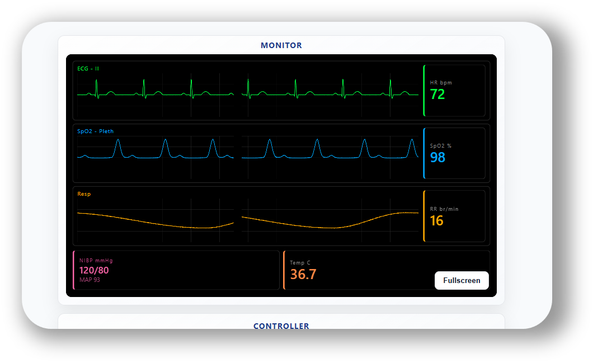

  

# Patient Monitor Simulator

A browser-based patient monitor simulator designed for clinical simulation and training. Displays live ECG, SpO2, and respiratory waveforms alongside vital sign numerics — all controllable in real time from a second device such as a phone or tablet.

---

## Getting Started

Open the monitor on any device by visiting the GitHub Pages link for this repository. No installation or login is required — it runs entirely in your browser.

---

## The Monitor Screen

When you first open the app, you will see the **monitor view**: a black screen showing three scrolling waveforms and a set of vital sign numbers.

| Display | What it shows |
|---|---|
| **ECG – II** | Heart rhythm trace (green) and heart rate in bpm |
| **SpO2 – Pleth** | Pulse oximetry waveform (blue) and oxygen saturation % |
| **Resp** | Respiratory waveform (amber) and respiratory rate br/min |
| **NIBP** | Systolic / diastolic blood pressure and mean arterial pressure |
| **Temp** | Body temperature in °C |

Use the **Fullscreen** button to expand the monitor to fill the screen — useful when projecting onto a large display in a simulation room.

### Showing the same monitor on multiple screens

Each monitor session has a room name that appears in the page URL once it loads (for example `…/?room=pm-a1b2c3`). To display the **same** monitor on another screen — a second projector, a screen in the control room, etc. — just copy that URL and open it on the other device. Every monitor sharing the room stays synced to the same controller in real time, and a monitor that joins late automatically catches up to the current vitals.

---

## Controlling the Monitor from a Second Device

The monitor is designed to be controlled from a separate phone or tablet so that a facilitator can change patient parameters without the learners seeing.

**Steps:**

1. On the monitor screen, look at the **QR code** shown below the waveform display.
2. Scan the QR code with a phone or tablet — this opens the **controller screen** on that device.
3. The status indicator will turn green once the controller is connected.

The controller and monitor communicate through a public MQTT message broker over a secure WebSocket connection. Each session uses its own randomly generated room ID, so messages stay scoped to your monitor and controller pair. This approach works reliably across different networks, NATs, and cellular connections.

---

## Using the Controller

The controller screen has two sections:

### Rhythm

Choose from the dropdown:

- **Sinus** — normal sinus rhythm
- **VT** — ventricular tachycardia
- **VF** — ventricular fibrillation

### Observations

Each vital sign has a row with:
- A **–** and **+** button to decrease or increase the value
- A toggle button to switch the parameter **on** or **off** (simulating a probe being attached or removed)

| Observation | What it controls |
|---|---|
| HR | Heart rate (bpm) |
| SpO2 | Oxygen saturation (%) |
| SBP / DBP | Systolic and diastolic blood pressure (mmHg) |
| RR | Respiratory rate (breaths per minute) |
| Temp | Temperature (°C) |

Changes take effect on the monitor screen immediately.

### Hold

The **Hold** button at the bottom of the Observations section lets you prepare several changes before sending them to the monitor.

1. Tap **Hold** — the button changes to **Release** and any adjustments you make are queued but not yet sent.
2. Adjust as many observations as needed.
3. Tap **Release** — all queued changes are sent to the monitor at once and ramp in smoothly over 10 seconds.

This is useful when you want to trigger a significant clinical change (for example dropping SpO2, heart rate, and blood pressure together) at a moment of your choosing during a scenario.

---

## Refreshing / Resetting

Refreshing the monitor page generates a new session. The controller QR code will change and any previously connected controller will disconnect. Simply scan the new QR code to reconnect.

---

## License

This project is licensed under the [GNU Affero General Public License v3.0](LICENSE).

### Third-party dependencies

This project makes use of the following third-party libraries and services, each with their own license terms:

- **[MQTT.js](https://github.com/mqttjs/MQTT.js)** — MQTT messaging between the monitor and controller. MIT License.
- **[HiveMQ Public Broker](https://www.hivemq.com/mqtt/public-mqtt-broker/)** — public MQTT broker used to relay messages between devices.
- **[NoSleep.js](https://github.com/richtr/NoSleep.js)** — prevents display sleep on mobile devices. MIT License.
- **[QR Server](https://goqr.me/api/)** — external API used to generate the controller QR code.
